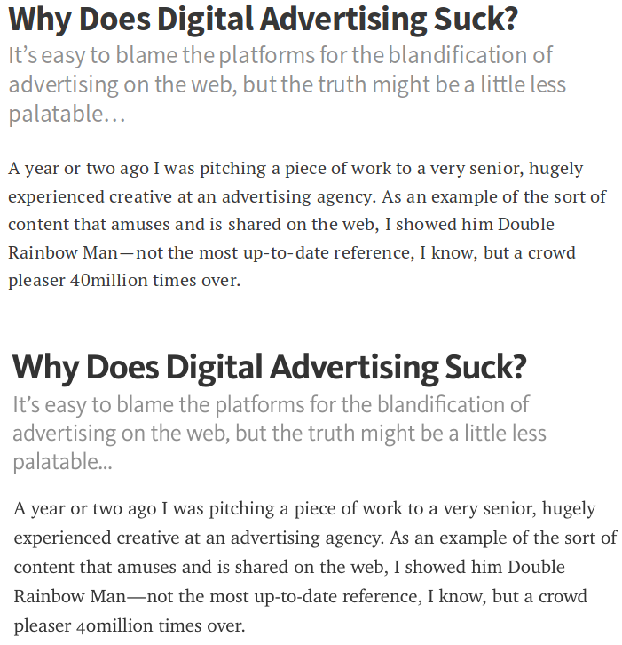

# Mimic Medium.com's Typography

A project to test a SCSS file that will try to mimic Medium.com's typography but using alternative free google web fonts.

## Getting Started

To test: just open the index.html file into the browser.

To use: just import medium.scss in your own projects. 

For more informations please vitis [Bad Penguin](http://www.badpenguin.org).

## Preview

The above part is the mimic CSS. The below part the is original medium.com's screenshot.

This is how it renderes on Chromium under Linux:

## Credits

- medium.com for creating such a wonderfull readable content
